# HDB Illustration

Exploratory data analysis of CFD pressure fields on HDB (Singapore public housing) building geometries. Extracts an 8-point pressure tensor per sampling location across ~920 cases and produces histograms, vertical profiles, scatter plots, and ParaView-ready meshes for visual inspection.

## Pipeline at a glance



For each case, buildings are isolated via DBSCAN, floors are detected from z-coordinates, and at every (floor, x-fraction) location four windward + four leeward pressure values are sampled — one on the surface and three on offset shells at 0.5 m, 2 m, and 3 m. Each row of the resulting tensor has 12 columns: `(p_b_w, p_a05_w, p_a2_w, p_a3_w, p_b_l, p_a05_l, p_a2_l, p_a3_l, floor_z, z_max, thickness, x_frac)`.

## 8-point sampling diagram (animated)

The animated walkthrough lives at [`methodology_diagrams/building_8point_sampling.html`](methodology_diagrams/building_8point_sampling.html). GitHub strips embedded `<style>` from Markdown, so to see the animation use one of:

- **Preview in browser (no download):** <https://raw.githack.com/3017xlin/HDB_Illustration/main/methodology_diagrams/building_8point_sampling.html>
- **Alternative preview:** <https://htmlpreview.github.io/?https://github.com/3017xlin/HDB_Illustration/blob/main/methodology_diagrams/building_8point_sampling.html>
- **Local:** clone the repo and open the file in any modern browser.

## Repository layout

```
.
├── extract.py                  # PT files  →  (N_total, 12) tensor saved as .npz
├── plot.py                     # Tensor    →  EDA plots
├── plot_edges.py               # Edge-case plotting utilities
├── export_paraview.py          # Single PT →  .vtp meshes for ParaView
├── methodology_diagrams/       # SVG + animated HTML explaining the pipeline
├── outlier_illustration/       # PNG renders of representative outlier cases
├── paraview/                   # Pre-exported .vtp meshes (normal + outlier building)
└── plots/                      # All generated EDA plots
    ├── hist_by_height/         # Pressure histograms binned by building height
    ├── hist_by_thickness/      # Pressure histograms binned by building thickness
    ├── overlay/                # Overlaid distributions
    ├── profile_by_thick/       # Vertical profiles grouped by thickness
    ├── profile_by_z/           # Vertical profiles binned by floor height
    └── scatter/                # bb vs aa scatter plots at each offset
```

## Quick start

```bash
# 1. Extract the tensor from a directory of PT files
python extract.py --input <dir_of_pt_files> --output tensor_data.npz

# 2. Generate all EDA plots
python plot.py --tensor tensor_data.npz --out plots/

# 3. Export a single case to ParaView-compatible meshes
python export_paraview.py
```

Dependencies: `numpy`, `torch`, `scipy`, `scikit-learn`, `matplotlib`, `pyvista`.

## Tensor column reference

| idx | name        | meaning                                              |
|----:|-------------|------------------------------------------------------|
| 0   | `p_b_w`     | windward surface pressure                            |
| 1   | `p_a05_w`   | windward pressure at 0.5 m offset (IDW interpolated) |
| 2   | `p_a2_w`    | windward pressure at 2 m offset                      |
| 3   | `p_a3_w`    | windward pressure at 3 m offset                      |
| 4   | `p_b_l`     | leeward surface pressure                             |
| 5   | `p_a05_l`   | leeward pressure at 0.5 m offset                     |
| 6   | `p_a2_l`    | leeward pressure at 2 m offset                       |
| 7   | `p_a3_l`    | leeward pressure at 3 m offset                       |
| 8   | `floor_z`   | floor centre-line z-coordinate (m)                   |
| 9   | `z_max`     | building height (m)                                  |
| 10  | `thickness` | windward–leeward thickness at this location (m)      |
| 11  | `x_frac`    | along-building position, 0–1                         |

## Sampling constants

Defined in `extract.py`:

- `U_REF = 2.0` m/s — reference velocity
- `FLOOR_GAP = 3.0` m — minimum z-gap used to split floors
- `X_BINS = 10` — number of x-fraction positions per floor
- `OFFSETS = [0.5, 2.0, 3.0]` m — shell offsets for IDW sampling
- `IDW_K = 4` — neighbours used for inverse-distance weighting
